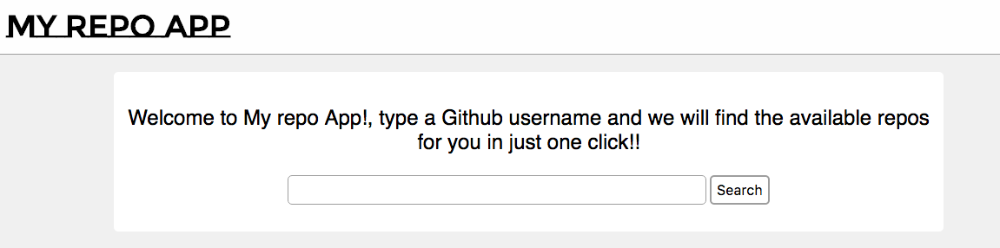

# Marfeel Repo Exercise

---
## Description 

This is a repo gitHub finder that for a given username it will show you the repositories created by this user and some user info. If the user does not exist, then it will show you an error message.

## Authors

* [Alejandro Vázquez Pérez](http://github.com/alejovp)

